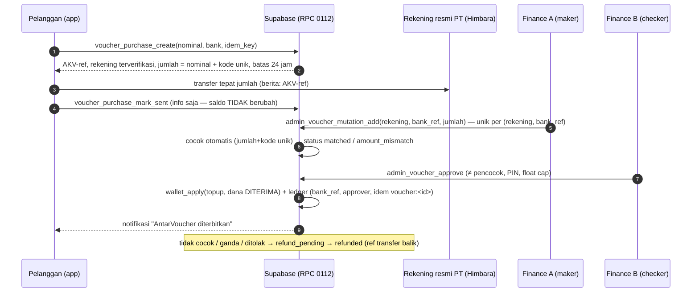

# AntarKita — Laporan Pembenahan Menyeluruh & AntarVoucher (v4)

Tanggal: 25 September 2026 · Branch `antarvoucher-v4` (di atas `finpay-v3`, basis `main` 81e040c) · Landing `landing-v4`
Label: **[FAKTA]** terbukti oleh uji/perintah · **[BELUM-DIBUKTIKAN]** belum dijalankan di lingkungan nyata · **[ASUMSI]** · **[KEPUTUSAN PEMILIK]**

## STATUS AKHIR (26 Sep 2026 00:30 WIB): **SELESAI BERSYARAT — LIVE** (web + DB produksi v4, pembelian AntarVoucher & Finpay OFF) · **NO-GO PRODUKSI** untuk transaksi AntarVoucher uang nyata · **Google Play: siap unggah (AAB 113), menunggu unggah & review**

| Bukti | Nilai |
|---|---|
| PR | #9 `antarvoucher-v4` → `main`, merge commit **12385ce** (25 Sep 2026 23:3x WIB); perbaikan CI **43c2099** |
| Web produksi | workflow *Web (3 aplikasi)* run 36161552180 ✅ dari 12385ce → apps.antarkitaindonesia.com (+/mitra, /admin, /terms v1.4 draf). Smoke test Chrome: beranda, Panel Admin (menu AntarVoucher), /pay/voucher "Segera hadir", 0 error konsol |
| DB produksi | 0098–0112 + 0113 diterapkan 25 Sep 2026 (skema_migrations 20260925009800…011300); snapshot `backup_20260925`; pasca-cek dompet≠Σmutasi 0, ledger order tak seimbang 0, flag pembelian OFF, provider midtrans, rekening publik 0 |
| APK | *Android APK* run #78 (36161552220) dari 12385ce ✅ → Release build-78 |
| AAB Play | *Play Store AAB* run #13 (36162134095) dari 12385ce, `dompet=off` ✅ → Release aab-13, versionCode 113 |

---

## 1. Ringkasan eksekutif

1. **Root cause push GitHub** ditemukan dan dibuktikan. Ada tiga lapis masalah (§3). Jalurnya kini tersedia lewat satu skrip yang dijalankan di Mac pemilik. Push tetap harus dilakukan pemilik karena kredensial GitHub hanya ada di macOS Keychain.
2. **P0 produksi ditutup hari ini (atas persetujuan GM):** sakelar AntarPay di produksi ternyata **AKTIF**. Layar Top Up menampilkan **rekening BCA pribadi**, dan admin menambah saldo berdasarkan screenshot. Sakelar sudah dinonaktifkan (tercatat di `audit_logs` #14205). Saat itu seluruh saldo Rp0 dan belum ada top up, jadi tidak ada dana terdampak **[FAKTA]**.
3. **AntarPay → AntarVoucher** sudah selesai di UI 3 aplikasi, 4 bahasa, pesan server, edge function, S&K/Privasi v1.4 (draf), dan landing. Kunci data lama (`antarpay_enabled`, saluran `antarpay`, `paid_via='wallet'`, tabel `wallets`) **sengaja dipertahankan**, sehingga APK lama tetap jalan dan tidak ada saldo atau transaksi yang hilang **[FAKTA: uji V1, V21, rollback]**.
4. **Pembelian AntarVoucher lewat transfer ke rekening resmi PT** (migrasi 0112):
   - Alurnya: referensi AKV + kode unik → mutasi bank dicatat Finance → pencocokan → penerbitan oleh **admin lain**.
   - Screenshot tidak pernah menambah saldo.
   - Rekening tampil hanya bila bukan placeholder, atas nama badan usaha, dan diverifikasi Finance **dan** Legal oleh dua orang berbeda.
   - Fitur ada di balik flag `antarvoucher_purchase_enabled`, **default OFF**.
5. **Ledger saldo** kini mencatat saldo awal/akhir, idempotency key, referensi bank, pembuat/approver, alasan koreksi, dan referensi refund/settlement. Ledger bersifat append-only. Saldo pelanggan tidak bisa minus. Ada batas float Rp900 juta, di bawah ambang izin PJP Rp1 miliar menurut PADG 32/2025 Ps. 21 **[PERLU VERIFIKASI LEGAL]**. Rekonsiliasi per pemilik saldo memakai rumus yang disepakati.
6. **Uji lokal hijau**: 228 + 124 + 62 + 22 skenario SQL, 58 tes Deno, 7 tes unit, `tsc` 0 error, dan rollback up→down→up dengan skema identik. **Belum**: APK di HP fisik, migrasi di Supabase staging/produksi, dan transaksi bank nyata.

## 2. Temuan P0–P3 dan status

| # | Prio | Temuan | Status |
|---|---|---|---|
| F-01 | **P0** | Produksi: AntarPay aktif, instruksi transfer ke **rekening pribadi** (BCA a.n. perorangan), saldo ditambah berdasar **screenshot** | **Ditutup** di produksi (sakelar OFF, 25 Sep 2026). Kode: rekening lama dinetralkan oleh 0112, `admin_review_topup` memblokir persetujuan tanpa mutasi bank, layar top up screenshot dihapus |
| F-02 | **P0** | Push GitHub gagal: branch `finpay-v3` (+`skema-bisnis-v2`) belum pernah sampai ke GitHub → tidak ada CI/APK/review | **Selesai**: Erza menjalankan `push-antarkita.sh` (b92a376); commit lanjutan lewat editor/upload web GitHub (terverifikasi md5); PR #9 di-merge |
| F-03 | P1 | `web.yml` bisa di-*dispatch* dari branch mana pun → menimpa situs produksi | **Diperbaiki**: deploy hanya dari `main` |
| F-04 | P1 | `android.yml` dari branch mana pun membuat **GitHub Release publik** (`releases/latest` dipakai tautan unduh di web) → build uji bisa jadi "rilis publik" | **Diperbaiki**: Release hanya dari `main`; branch lain = artifact berlabel `-INTERNAL` + pita "INTERNAL TESTING" di aplikasi + SHA-256 di ringkasan |
| F-05 | P1 | Ledger dompet tanpa saldo awal, pembuat/approver, idempotensi; bisa di-UPDATE/DELETE | **Diperbaiki** (0112) |
| F-06 | P1 | Saldo pelanggan bisa minus lewat penyesuaian admin | **Diperbaiki** (trigger `SALDO_TIDAK_CUKUP`; mitra tetap boleh minus untuk potongan komisi tunai — aturan lama) |
| F-07 | P1 | Produksi baru sampai migrasi 0097; 0098–0111 (skema bisnis v2, Finpay v3) + 0112 belum diterapkan | **Selesai** 25 Sep 2026: uji kering pada replika fungsi produksi → snapshot → 0098–0113 diterapkan per berkas |
| F-13 | P1 | APK di luar Play ditandatangani kunci yang tidak terdaftar di Android developer verification (wajib 30 Sep 2026 untuk perangkat bersertifikat di Indonesia) | **Diperbaiki sebagian**: CI memakai upload key + kunci didaftarkan (In review) — tunggu status Verified |
| F-14 | P2 | Integrasi Cloudflare *Workers Builds* "antarkita" pada repo gagal di branch (main sebelumnya sukses); Claude tidak punya akses dasbor Cloudflare | Terbuka — pemilik cek log build di dash.cloudflare.com |
| F-15 | P2 | S&K live menampilkan "Versi 1.4 [DRAF]" | Terbuka — butuh persetujuan Legal untuk mengesahkan v1.4 |
| F-08 | P1 | Kartu pendapatan mitra patah per digit di 320 px ("Rp1.250.00 / 0") — juga di main | **Diperbaiki** |
| F-09 | P2 | Label tab "AntarVoucher" terpotong di semua lebar HP | **Diperbaiki** (label tab "Voucher"); di 320 px label tab lain juga terpotong — sama dengan main |
| F-10 | P2 | `npm audit`: 15 moderate (0 high/critical) pada dependensi produksi | Terbuka — dicatat, tidak diperbarui paksa (risiko regresi Expo) |
| F-11 | P2 | `uji_kota_dan_tarif.sql` gagal pra-syarat "≥520 kota" (data lokal 515) | Terbuka, **bukan akibat v4** (tidak menyentuh data kota) |
| F-12 | P3 | Target sentuh < 44 px pada beberapa ikon admin/tab; `expo lint` tidak punya konfigurasi ESLint | Terbuka (lihat laporan UI) |

## 3. Root cause push GitHub (bukti)

| Lapis | Bukti | Kesimpulan |
|---|---|---|
| Container sesi Claude | `git push` → `remote: access denied by the git proxy: erzamadana-ui/antarkita is not in this session's authorized repository set` (HTTP 403) | Link repo di Project **bukan** "source" sesi → proxy tidak menyuntik kredensial. Bukan masalah branch protection/konflik/LFS |
| VM Cowork di Mac | `git ls-remote` & `api.github.com` = 200, tapi tidak ada kredensial | Jaringan OK, kredensial tidak ada |
| Clone `~/Downloads/antarkita` | remote HTTPS tanpa token; helper = macOS Keychain; Terminal bagi AI hanya "click" | Push hanya bisa dari Terminal pemilik |
| Riwayat | `finpay-v3` = fast-forward dari `origin/main` 81e040c (18 commit), tidak ada konflik, tidak ada berkas > 50 MB, `.env` hanya kunci anon (role=anon) | Tidak perlu force push |

**Penyelesaian (terbukti):** Erza menjalankan `push-antarkita.sh` → `finpay-v3` 9273e65, `antarvoucher-v4` b92a376, `landing-v4` 096eb08 tiba di GitHub (25 Sep 2026). Commit lanjutan (0113, runbook, perbaikan CI) dikirim lewat **editor/upload web GitHub** di Chrome Erza, isi diverifikasi md5 dengan salinan lokal. Solusi permanen tetap: tambahkan repo sebagai *source* sesi Cowork, atau PAT di secret manager.

## 4. Branch, commit, workflow, deployment

| Repo | Branch | HEAD | Isi |
|---|---|---|---|
| antarkita | `finpay-v3` | 9273e65 | 18 commit (skema bisnis v2 + Finpay v3) |
| antarkita | `antarvoucher-v4` | lihat §0 | +commit v4: `c861308` DB 0112 · `d85b1cb` rebrand · `64b8e46` layar AntarVoucher · `473589d` CI internal · `4bedeeb` perbaikan UI · (dok) |
| antarkita-landing | `landing-v4` | 096eb08 | landing v3 + AntarVoucher |

Deployment produksi **tidak diubah** kecuali sakelar AntarPay OFF. Web live tetap dari `main` 81e040c. Merge ke `main` = rilis publik, jadi **menunggu persetujuan eksplisit**.

## 5. Berkas & modul yang diubah (vs `finpay-v3`)

- **DB:** `supabase/migrations/0112_antarvoucher.sql`, `supabase/rollback/0112_down.sql`, `supabase/tests/uji_antarvoucher.sql` (baru); `simulasi_e2e.sql` (fixture `legacy_topup_manual_approval` + pesan), `uji_skema_bisnis_v2.sql` (pesan), `scripts/uji-rollback.sh` (0112).
- **Aplikasi (baru):** `src/screens/pay/voucher.tsx`, `src/lib/voucher.ts`, `src/screens/admin/voucher.tsx`, `src/components/InternalBuildRibbon.tsx`, rute `apps/{pelanggan,mitra}/app/pay/voucher.tsx`, `apps/admin/app/(admin)/voucher.tsx`.
- **Aplikasi (ubah):** `pay/topup.tsx` (tanpa rekening pribadi & screenshot), `WalletView.tsx` (rekonsiliasi bulan ini), `admin/finance.tsx` (top up lama → konversi), `admin/_layout.tsx` (menu), `driver/tabs/earnings.tsx`, `customer/_layout.tsx`, `RootLayout.tsx`, rename `AntarPayNotice` → `AntarVoucherNotice`, dan ±45 berkas teks AntarPay → AntarVoucher.
- **Edge:** `pay-create/handler.ts`, `midtrans-create/index.ts` (teks).
- **CI:** `.github/workflows/android.yml`, `web.yml`. **Versi:** `package.json` 3.1.0.
- **Hukum/dok:** `docs/rilis/terms.html` (v1.4 draf + §5.1 pembelian voucher), `privacy.html`, `hapus-akun.html`, README, listing Play/App Store, `docs/antarvoucher/*`.

## 6. Arsitektur & aliran dana AntarVoucher

Status pembelian: `awaiting_transfer → submitted → matched|amount_mismatch → issued → (refund_requested → refund_pending → refunded)`; cabang lain: `expired` (job 15 menit; transfer terlambat ≤ 7 hari masih bisa dicocokkan), `cancelled`, `rejected`, `disputed`.

Pemakaian voucher dan pendapatan mitra memakai jalur yang sudah ada: `create_order` (wallet), `order_ledger` v2/v3, dan payout v3. Ongkir tetap hak driver dan pendapatan mitra tetap dapat dicairkan ke rekening. Pendapatan driver **tidak** dipaksa menjadi voucher.

## 7. Skema ledger, fee, refund, settlement

**`wallet_transactions`** (tambahan 0112): `balance_before`, `balance_after`, `amount (±)`, `type`, `source` (topup, voucher_purchase, order_payment, earning, refund_in, voucher_refund, payout, fee, adjustment), `order_id`, `ref`, `idempotency_key` (unik), `bank_ref`, `created_by`, `approved_by`, `correction_reason` (wajib untuk adjustment), `refund_ref`, `settlement_ref`, `status`, `seq`.
- Append-only: UPDATE/DELETE ditolak. Pengecualiannya kolom `pg_fee`, dan jalur pemeliharaan terkendali di dalam RPC yang melengkapi baris yang baru dibuatnya.

**Tabel baru:** `company_bank_accounts`, `voucher_purchases`, `voucher_bank_mutations` (RLS: pelanggan hanya melihat pembeliannya sendiri; rekening mentah & mutasi hanya untuk admin).

**Rekonsiliasi** (`wallet_statement`, `admin_wallet_reconcile`):
`saldo awal + pembelian + pendapatan + refund masuk − penggunaan − refund keluar − payout ± koreksi = saldo akhir`
Rumus asli dari brief tidak memisahkan *refund masuk* (refund pesanan yang dikreditkan ke saldo) dari *refund keluar* (dana voucher dikembalikan ke bank). Keduanya dipisah di sini supaya tidak salah tanda. Global: Σ voucher terbit = Σ mutasi bank tercocok, dan setiap dompet = Σ mutasinya.

**Fee:** skema fee v2/v3 tidak diubah, sehingga seluruh komponen tetap terpisah di checkout, dapat dikonfigurasi, dan tercatat di `order_ledger`. Pembelian voucher lewat transfer **tidak dikenai biaya** oleh AntarKita. Kode unik justru ikut masuk ke saldo.

## 8. Migrasi & rollback plan

1. **Staging dulu:** buat branch/proyek Supabase staging → terapkan 0098→0112 **berurutan** → jalankan `uji_skema_bisnis_v2`, `uji_finpay_v3`, `uji_antarvoucher` → semua 0 BUG.
2. **Produksi** (jendela rilis, atas persetujuan tertulis):
   - Backup.
   - Terapkan 0098→0112, lalu `select admin_wallet_reconcile(...)` harus `ok=true`.
   - Rilis web `main` di jendela yang sama.
   - `antarvoucher_purchase_enabled` tetap **false**.
3. **Rollback fungsional (tanpa sentuh data):** matikan flag pembelian dan/atau sakelar AntarVoucher.
4. **Rollback skema:** `0112_down.sql` → `0111_down` … `0105_down`. `0112_down` **menolak** berjalan bila sudah ada voucher terbit, kecuali dipaksa dengan `antarkita.force_rollback_0112=on` setelah arsip. Baris ledger uang tidak pernah dihapus.
5. **Aplikasi lama:** APK ≤ 3.0.0 tetap berfungsi. Layar top up lamanya kini menampilkan "Rekening resmi PT belum terverifikasi — perbarui aplikasi". Permintaan top up lama tidak bisa disetujui tanpa mutasi bank, dan hanya bisa dikonversi ke AntarVoucher.

## 9. Audit keamanan & UI/UX

**Keamanan [FAKTA lokal]:**
- Tidak ditemukan secret di repo: pola kunci privat, token GitHub/AWS/Midtrans server, dan JWT non-anon. `.env` hanya berisi kunci anon.
- RLS pada 3 tabel baru teruji: anon tidak bisa memanggil daftar rekening.
- RBAC dan PIN berlaku di semua RPC admin baru; `uji_finpay_v3` S52 menjaga agar RPC admin volatile tidak lolos tanpa `admin_require`.
- Maker-checker berlaku di 3 titik: verifikasi rekening, penerbitan, dan refund.
- Anti kredit ganda: `(rekening, bank_ref)` unik, `idempotency_key` unik, dan approve bersifat idempoten.
- Rate/batas: maksimal 2 pembelian terbuka per pengguna.
- `npm audit`: 0 high/critical.

**UI/UX:**
- Diuji pada 75 kombinasi halaman × lebar (320–430, 768, 1366) di build web dengan data tiruan.
- Hasil: 0 overflow horizontal, 0 error konsol. Teks terpotong turun 190 → 30.
- 9 perbaikan P1/P2.
- Detail di `LAPORAN-AUDIT-UI.md` dan screenshot sebelum/sesudah di `screenshots/`.
- Keterbatasan: build web ≠ APK native, tanpa HP fisik, dan skala font sistem hanya disimulasikan (130 %).

## 10. Hasil pengujian

| Uji | Hasil |
|---|---|
| `simulasi_e2e.sql` | LULUS 228 OK, 0 BUG (2 bug dikenal lama S55g/h — beda pesan) |
| `uji_skema_bisnis_v2.sql` | LULUS 124 OK |
| `uji_finpay_v3.sql` | LULUS 62 OK |
| `uji_antarvoucher.sql` (baru) | LULUS 22 OK — flag, rekening, pembelian, idempoten, top up screenshot diblokir, mutasi & anti-duplikat, maker-checker, salah nominal, transfer ganda, kedaluwarsa & terlambat, batal, sengketa, refund, saldo tidak cukup, append-only, float cap, rekonsiliasi, RLS, invarian |
| `uji_keamanan.sql`, `uji_idempotensi.sql` | LULUS 5 OK, 4 OK |
| `scripts/uji-rollback.sh` (0105–0112) | LULUS — down=baseline, up→down→up identik, sebagian identik, 4 suite hijau di DB hasil rollback |
| Deno `supabase/functions/tests` | 58 passed, 0 failed |
| `npm test` (audio/push/order) | semua lulus |
| `tsc --noEmit` | 0 error |
| Lint | tidak tersedia (repo tanpa konfigurasi ESLint) |
| Android lint / build APK | **via CI setelah push** (§11) |
| Uji transaksi uang nyata | **Tidak dilakukan** (sesuai aturan) |

## 11. APK

| Berkas | Paket | versionName / Code | min/target SDK | SHA-256 |
|---|---|---|---|---|
| antarkita-pelanggan-78-INTERNAL.apk (83 MB) | id.antarkita.app | 3.1.0 / 178 | 24 / 36 | `99742d1ee388424fad9641ec0988a7ca79820ed2c9f7f660de154223090d41e0` |
| antarkita-mitra-78-INTERNAL.apk (83 MB) | id.antarkita.mitra | 3.1.0 / 178 | 24 / 36 | `827238fdfb9aa8f3705bd995b20a4c33283881438f36ce87e011201f3af5ffeb` |
| antarkita-pelanggan-v3.1.0-113.aab (97 MB, tanpa dompet) | id.antarkita.app | 3.1.0 / 113 | — | `c2b3d453d783f6a07e5580b847d054167cbea6157317494b41018d3802ccbf21` |
| antarkita-mitra-v3.1.0-113.aab (97 MB, tanpa dompet) | id.antarkita.mitra | 3.1.0 / 113 | — | `7af01fc272f5f26b7b77a69e95bf737c519947e1e192531f0c34fe818dd71a4d` |

- APK build-78 ditandatangani **upload key** (sertifikat SHA-256 `DE:62:04:47:…:E9:F9`, APK Signature Scheme v2; diverifikasi dengan androguard). Kunci ini **ditambahkan ke Android developer verification** untuk kedua paket (status *In review*, 26 Sep 2026) — sebelumnya tidak terdaftar.
- Nama berkas build-78 berakhiran `-INTERNAL` karena bug ekspresi di workflow (string kosong = falsy); diperbaiki di 43c2099. Label itu sesuai kenyataan: **INTERNAL TESTING — BUKAN VERSI PRODUKSI** (belum diuji di HP fisik).
- Izin di manifest APK memuat izin turunan pustaka (badge launcher, READ/WRITE_EXTERNAL_STORAGE, USE_BIOMETRIC/FINGERPRINT, BLUETOOTH, WRITE_SETTINGS) di luar daftar minimal `app.config.ts` — **perlu ditinjau sebelum review Play** (Data safety & kebijakan izin). [TEMUAN P2 BARU]

## 12. Changelog 3.1.0 (internal)

- AntarPay sekarang bernama **AntarVoucher**. Saldo dan riwayat tetap utuh.
- Layar baru **Beli AntarVoucher**: transfer ke rekening resmi PT dengan kode unik, hitung mundur, status, batal, dan lapor masalah. Layar ini masih tertutup sampai rekening resmi dan persetujuan Legal/Finance tersedia.
- **Isi AntarVoucher** tidak lagi menampilkan rekening perorangan dan tidak lagi meminta unggah bukti transfer.
- Dompet menampilkan **Rekonsiliasi saldo bulan ini**.
- Panel Admin mendapat menu **AntarVoucher**: antrean, mutasi bank, rekening resmi (Finance/Legal), rekonsiliasi, dan sakelar. Top up lama hanya bisa dikonversi.
- Perbaikan tampilan di layar 320–430 px, termasuk kartu pendapatan mitra dan label tab.
- Build uji ditandai **INTERNAL TESTING — BUKAN VERSI PRODUKSI**.

## 13. Panduan instalasi, upgrade, rollback APK (internal)

1. Unduh artifact `antarkita-pelanggan-apk` / `antarkita-mitra-apk` dari run workflow "Android APK" di branch `antarvoucher-v4`. Artifact hanya bisa diunduh dengan login GitHub.
2. Cocokkan SHA-256: `shasum -a 256 antarkita-*-INTERNAL.apk` harus sama dengan berkas `.sha256` / ringkasan run.
3. **Upgrade** di atas versi lama: package id tetap `id.antarkita.app` / `id.antarkita.mitra`, jadi data login tetap ada. Bila muncul "konflik tanda tangan", artinya APK lama berasal dari AAB Play (kunci upload berbeda). Uninstall dulu. **Instal baru**: izinkan "instal dari sumber tidak dikenal".
4. **Rollback**: uninstall, lalu pasang APK `build-N` sebelumnya dari GitHub Releases (`main`). Sisi server tidak berubah selama migrasi belum diterapkan.
5. Uji minimal di HP fisik: login/logout, pesan tunai, dompet, layar Beli AntarVoucher (tampil "belum dibuka"), panel pendapatan mitra, notifikasi, lalu tutup paksa dan buka ulang.

## 14. Matriks perbandingan (ringkas; lengkap + sumber di `RISET-MAXIM-DAN-REGULASI-VOUCHER.md`, diakses 25 Sep 2026)

| Aspek | AntarVoucher (desain) | Saldo Maxim (terverifikasi) | Payment gateway VA/QRIS | Tunai | Transfer biasa |
|---|---|---|---|---|---|
| Cara isi | Transfer ke rekening resmi PT + kode unik; dicocokkan mutasi bank | Maxim Wallet KasPro (m-banking, minimarket Rp50rb–1jt) | VA/QRIS per transaksi | Ke driver | Manual per perjalanan |
| Biaya pelanggan | Rp0 (sesama bank) s.d. Rp2.500 BI-FAST | tidak terverifikasi | umumnya ditanggung merchant | Rp0 | Rp0–2.500 |
| Biaya platform | Operasional Finance; tanpa fee PG | tidak terverifikasi | VA Rp3.500–4.000; QRIS 0,7 % | risiko setoran komisi | rekonsiliasi manual |
| Konfirmasi | Menit–jam (jam kerja Finance) | disebut instan | real-time | seketika | lambat |
| Refund | Diatur S&K §5.1, maker-checker | bonus tidak dapat diuangkan; lainnya tidak terverifikasi | tergantung kanal | langsung | manual |
| Audit trail | Kuat (ledger + bank_ref + 2 petugas) | di penerbit UE berizin | kuat | lemah | sedang |
| Beban regulasi / izin | UE closed loop; **izin PJP wajib bila float ≥ Rp1 M** (PADG 32/2025 Ps. 21) — kajian legal | beban izin di KasPro | di PG | minimal | minimal |
| UX | Sedang (keluar app untuk transfer) | baik | sangat baik | familiar | buruk |

Keunggulan yang **boleh** diklaim (berbasis desain, bukan perbandingan pasar): transparansi (referensi & kode unik, rincian saldo), audit trail (bank_ref, dua petugas), dan perlindungan hak mitra (ongkir tetap hak driver dan pendapatan tetap bisa dicairkan). Klaim "lebih murah/lebih cepat dari Maxim" **tidak** boleh dipakai karena tidak ada bukti.

## 15. Risiko & keputusan yang dibutuhkan

| # | Keputusan | Pemilik | Apa yang rusak duluan bila tidak diputuskan |
|---|---|---|---|
| V1 | Rekening resmi atas nama **badan usaha** (PT/CV + NIB/NPWP). Saat ini belum ada; placeholder 5 bank Himbara | Founder + Finance | Fitur pembelian tidak bisa dibuka |
| V2 | Kajian legal AntarVoucher sebagai **UE closed loop**, batas float, safeguarding/pemisahan dana, perlakuan pajak (PMK 6/2021), PSE | Legal | Menerima dana publik tanpa kajian = risiko regulasi BI |
| V3 | Kebijakan refund voucher: siapa menanggung biaya transfer balik; batas waktu; masa berlaku voucher (saat ini **tanpa kedaluwarsa saldo**) | Finance + Legal | Sengketa pelanggan |
| V4 | Kode unik dikreditkan ke saldo (desain sekarang) vs dianggap pendapatan | Finance | Selisih pembukuan |
| V5 | SDM Finance **minimal 2 orang** berbeda (maker ≠ checker), plus 1 verifikator Legal untuk rekening | Founder | Voucher tidak pernah bisa diterbitkan |
| V6 | Jendela migrasi produksi 0098→0112 dan merge `finpay-v3` + `antarvoucher-v4` ke `main` (= rilis web publik) | Founder | Kode v2/v3/v4 tetap tidak live |
| V7 | Isi placeholder hukum: nama badan usaha, kota, biaya refund, mitra pembayaran | Founder + Legal | S&K v1.4 tidak bisa terbit |
| V8 | Jalur Play Store: sementara **build tanpa dompet** (AAB 113, sudah dibangun); jangka menengah akun organisasi (D-U-N-S) | Founder | Listing Play tertahan |
| V10 | Unggah AAB 113 (97 MB, di atas batas unggah otomasi 10 MB) ke Closed testing Pelanggan & Mitra, lalu ubah *Financial features* → tidak ada, tinjau Data safety & izin, *Send for review* — atau isi secret `PLAY_SERVICE_ACCOUNT_JSON` agar CI mengunggah sendiri | Erza (unggah) → Claude (deklarasi & kirim) | Tidak ada rilis Play |
| V11 | Merge `landing-v4` (placeholder hukum masih tampil) | Founder + Legal | Landing tetap versi lama |
| V9 | Integrasi mutasi otomatis (API bank / VA korporat) untuk mengganti input manual Finance | Finance + IT | Beban manual & keterlambatan saat volume naik |

**Yang akan rusak duluan setelah fitur dibuka:** antrean pencocokan manual di luar jam kerja. Pelanggan akan menunggu jam-jaman dan tiket CS naik pada minggu pertama. Mitigasinya: SLA tertulis, jam layanan di layar, dan V9.

---
*Catatan keterbatasan data: seluruh pengujian dilakukan pada harness PostgreSQL lokal + stub Supabase, Deno tanpa jaringan, dan build web dengan data tiruan. Belum ada uji di Supabase staging/produksi, HP fisik, maupun mutasi bank nyata. Informasi Maxim dan regulasi diambil dari sumber publik yang diakses 25 Sep 2026, dengan kutipan pasal dari ringkasan halaman, jadi wajib dicocokkan dengan PDF resmi sebelum dipakai secara hukum. Nomor rekening tidak diisi (placeholder) karena belum ada data resmi.*
